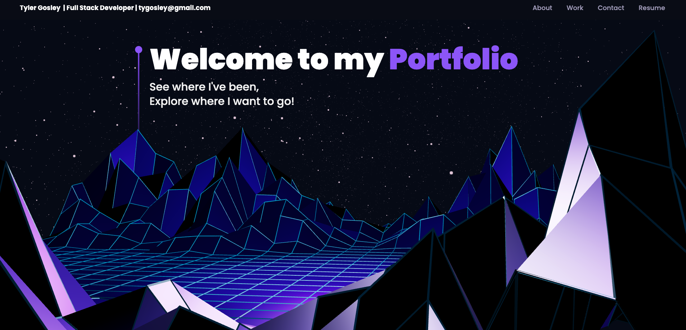
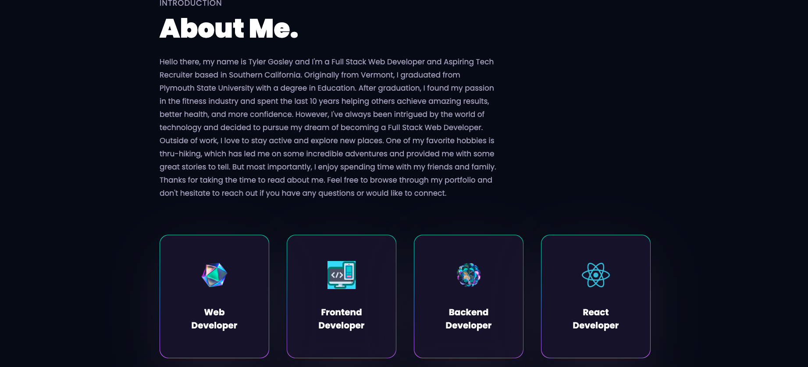
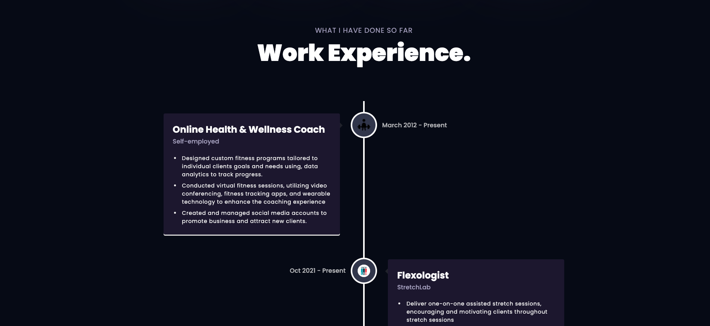
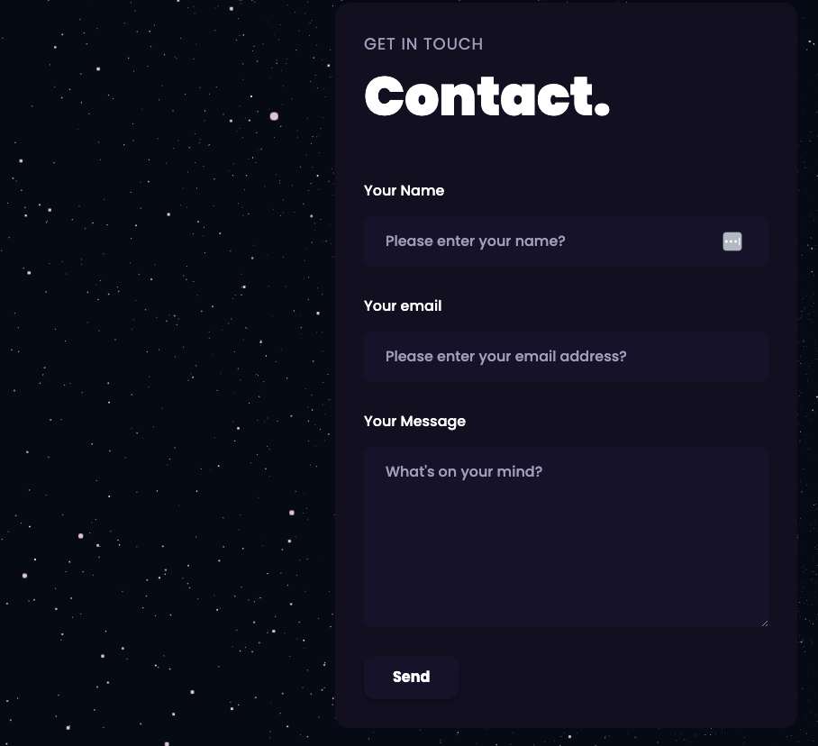

# Tyler's 3D React  Portfolio

  

## Description

Welcome to my first crack at Three.js. I decided to build a new React Portfolio with the skills I had learned in my UCLA extension Full Stack Development bootcamp. This project introduced me to some new technologies.  
___

## Table of Contents

- [Link](#link)
- [Technologies](#technologies)
- [Installation](#installation)
- [Usage](#usage)
- [Screenshot](#screenshot)
- [Licenses](#licenses)
- [Contributing](#contributing)
- [Questions](#questions)
- [Credits](#credits)

___

## Link

___

To view my React Profile, React to the Future, please click 👉 [Here](TODO:)

___

## Technologies

___

## Installation

To install and set up the React MERN Stack Application, follow these simple steps:

1. Make sure you have Node.js and npm (Node Package Manager) installed on your system.

1. Download or clone the project repository from the designated source.

1. Open a terminal or command prompt and navigate to the project directory.

1. Run the following command to install the required dependencies: `npm install`: This command will fetch and install all the necessary packages and libraries needed for the application to run smoothly.

1. After the installation is complete, run the following command to start the development server: `npm run dev`:

This command will initiate the server and compile the React components, allowing you to access and interact with the application in your browser.
___

## Usage

FILL In
___

## Screenshot

___

**Homepage**

**About Section**

**Experience Section**

**Projects Section**

**Contact Section**

## Licenses

      This project is covered under the MIT license. To learn more about what this means, click the license button at the top.

___

## Contributing

If you want to contribute or give some great feed back, please reach out!

___

## Questions

Have questions about this project?  Please reach out to me.

| GitHub Username                    | Email          |
| --------                           | -------------- |
| <https://github.com/TyGosley>  | <tygosley@gmail.com>  |

## Credits

___

[React](https://react.dev/)

[FormSpree](https://formspree.io/)

[JS Mastery](https://github.com/adrianhajdin/project_3D_developer_portfolio)

[Font Awesome](https://fontawesome.com/icons)

[Node.JS](https://nodejs.org/en/docs)

[Express.JS](https://expressjs.com/en/guide/routing.html#express-router)

[Codecademy](https://www.codecademy.com/learn)

[Khan Academy](https://www.khanacademy.org/)

[MDN Docs](https://developer.mozilla.org/en-US/)

[W3Schools](https://www.w3schools.com/js/default.asp)

[JavaScript.info](https://javascript.info/)

[CodeHS](https://codehs.com/)
